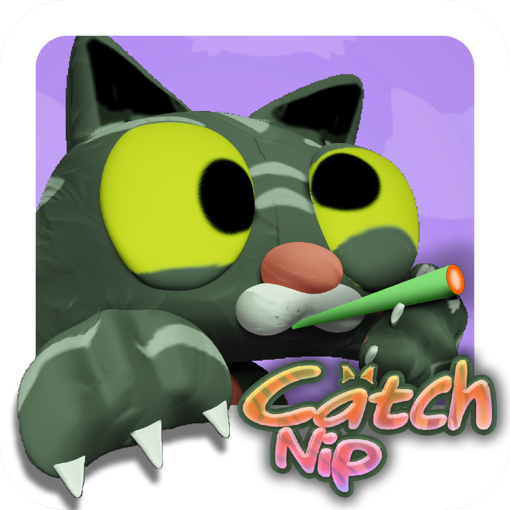
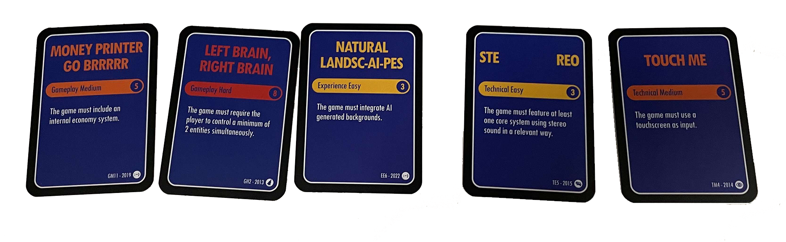
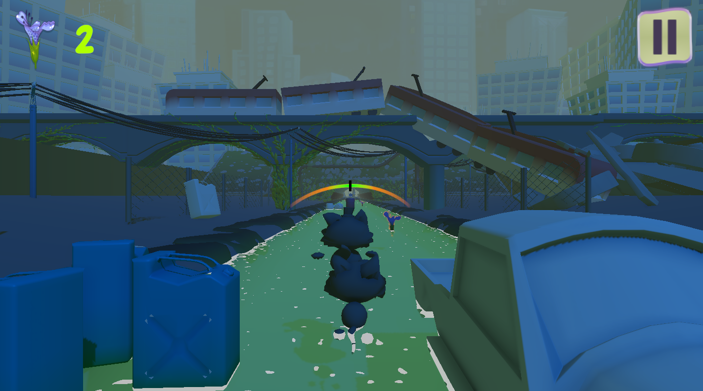
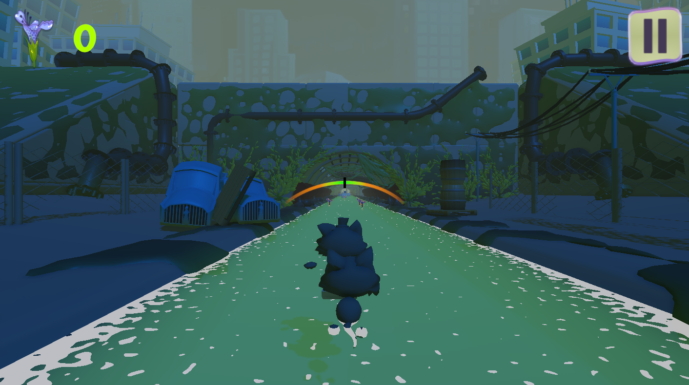

# gacha2022
Catsh' Nip

Play the game : https://nolwenna.itch.io/catch-nip

Theme : AI

Mobile Runner - 1 player

In Catch Nip', you must both manage your balance by orienting your phone, and your movements simultaneously.

My missions : Environment Artist - Gameplay Programmer

As part of the Ubisoft GACHA 2022, we created this game in less than 72 hours. We had to draw 5 destiny cards (constraints) that led us to create this game.

In Catch Nip', you must both manage your balance by orienting your phone, and your movements simultaneously.

If you lose your balance, our dear Jean Poil IV will end up in the water, and you know how much cats dislike that!
To win, you must finish the level without having any accidents: the more catnip you collect, the more the cat will be under its hallucinogenic effects, 
and this will allow you to earn more points at the end of the level!

During this project I had to work with a team of 10 and short times issues. 
I developed the gameplay mechanics of balancing movements with the jump and the obstacles. 
My two other dev mates made the store and the scene management with all the UIs.

